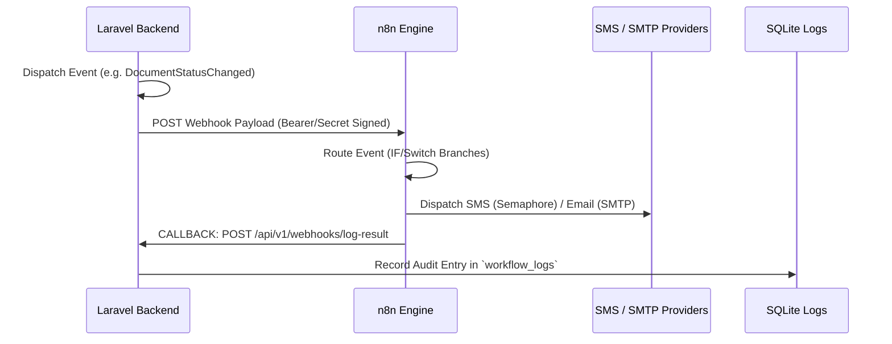

# 🤖 n8n Workflow Automation & Notifications System

This directory contains the production-ready **n8n Workflow Configurations** for the Web-Based Barangay Information System. 

To maximize operational efficiency and maintainability, the 9 individual notification flows are consolidated into **4 highly optimized Master Pipelines** utilizing conditional branch routing (`IF` / `Switch` nodes). This prevents workflow clutter and ensures unified error handling and audit trails.

---

## 🗺️ System Automation Topology

The automation engine operates on a robust **Event-Driven Closed-Loop Audit architecture**:

---

## 🛠️ Unified Master Workflows

| Master Workflow JSON | Consolidated Flows | Trigger Endpoint | Channels |
|----------------------|--------------------|------------------|----------|
| **[resident_welcome.json](./resident_welcome.json)** | 1. Resident Welcome Profile Card Creation | `/webhook/resident-created` | SMS + Email |
| **[document_workflow.json](./document_workflow.json)** | 2. Document Filed Alert 3. Document Approval Alert 4. Document Rejection Alert 5. Document Released Receipt | `/webhook/document-status` | SMS + Email |
| **[blotter_workflow.json](./blotter_workflow.json)** | 6. Blotter Case Initial Filing 7. Case Status Update (Investigation) 8. Case Settled Agreement | `/webhook/blotter-status` | Email (Parties + Officer) |
| **[announcement_broadcast.json](./announcement_broadcast.json)** | 9. Targeted / Barangay-Wide Broadcast Blaster | `/webhook/announcement` | SMS / Email loop |

---

## 🔑 Required Credentials & Env Variables in n8n

Ensure the following variables/credentials are defined in your n8n environment before importing the workflows:

1. **Semaphore API Credentials** (SMS):
   - URL: `https://api.semaphore.co/api/v4/messages`
   - Method: `POST`
   - Form Data:
     - `apikey`: Your Semaphore API Key
     - `sendername`: `BRGY` (or registered name)

2. **SMTP Email Credentials**:
   - Host: `smtp.gmail.com`
   - Port: `465` (SSL) / `587` (TLS)
   - User: `noreply@barangay.gov.ph` (or your SMTP username)
   - Password: App-specific password

3. **Laravel API Webhook Secret** (Header authentication):
   - Key: `X-Webhook-Secret`
   - Value: `barangay_n8n_secret_2026`

---

## 📥 How to Import & Run

1. Open your n8n dashboard (usually running at `http://localhost:5678`).
2. Click on **Add Workflow** → **Import from file...**
3. Select any of the JSON files in this directory.
4. Update the **Webhook node** URL path if needed.
5. In n8n, change the credentials in the **SMTP** and **Semaphore HTTP Request** nodes to your live credentials.
6. Toggle the workflow status in n8n to **Active**.
